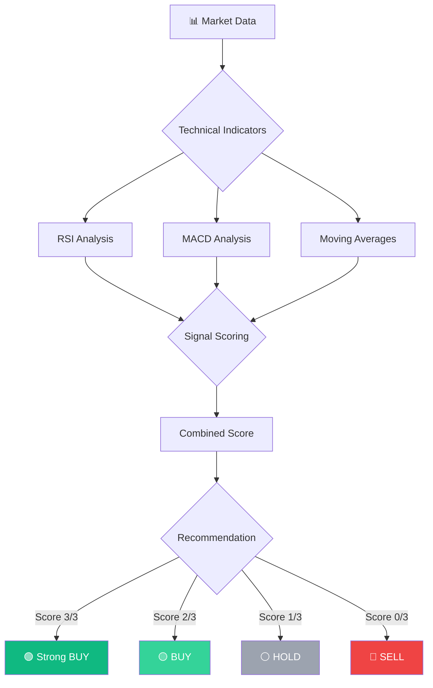
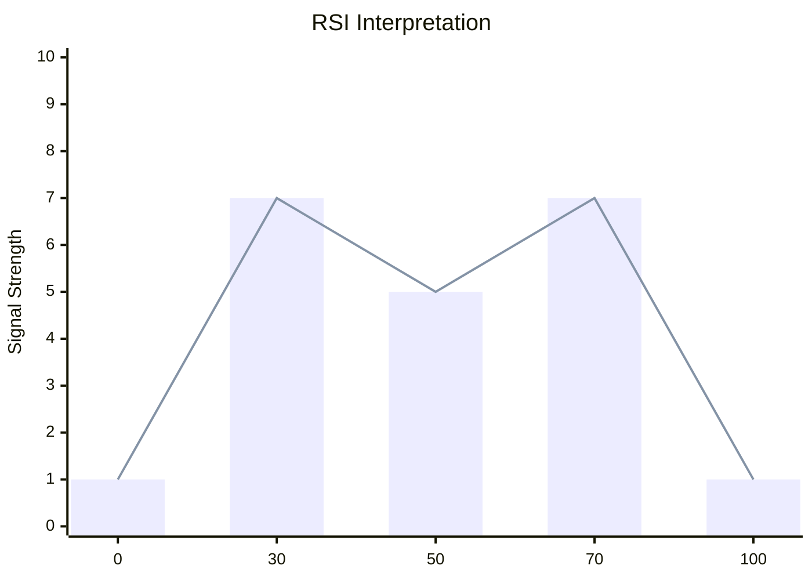
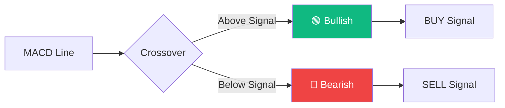
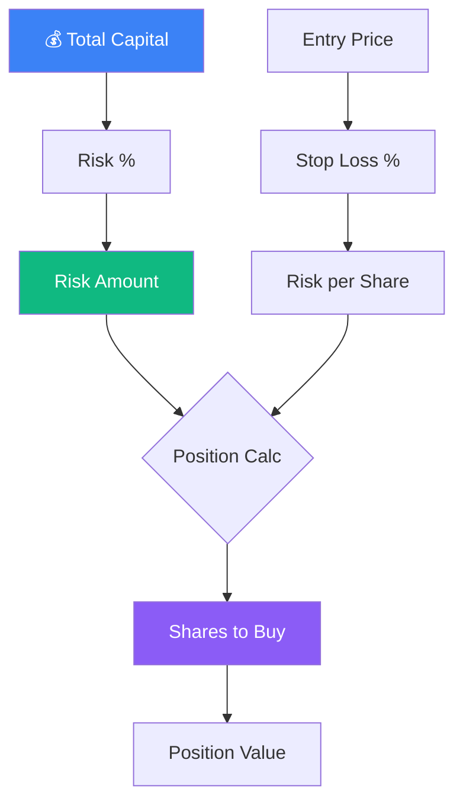
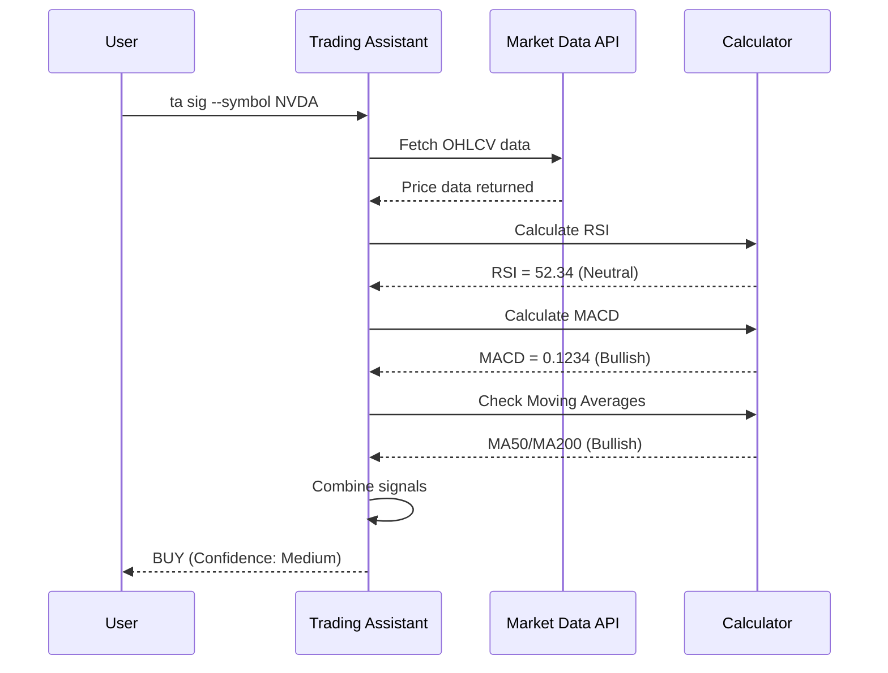
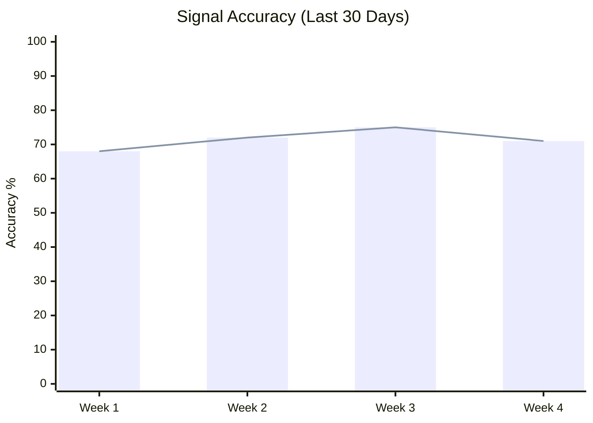
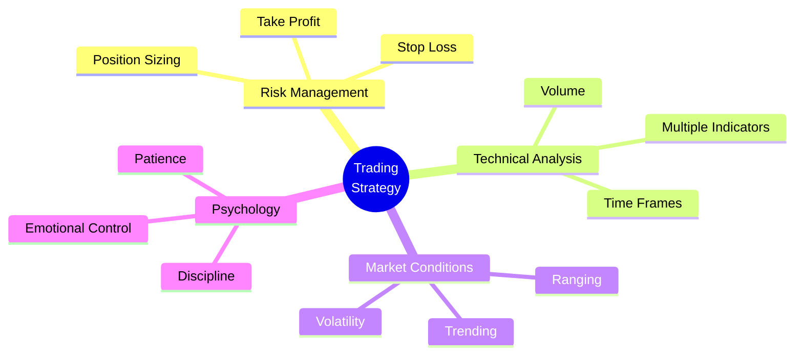

---
hide:
  - navigation
  - toc
---

# 📈 Trading Signals Guide

**Understand how our AI generates trading signals**

---

## 🎯 Signal Generation Process



---

## 📊 Indicator Breakdown

### RSI (Relative Strength Index)



| RSI Range | Signal | Meaning |
|-----------|--------|---------|
| 0-30 | 🟢 Oversold | Potential BUY |
| 30-50 | 🟡 Weak | Caution |
| 50-70 | 🟡 Strong | Bullish |
| 70-100 | 🔴 Overbought | Potential SELL |

---

### MACD (Moving Average Convergence Divergence)



---

## 💰 Position Sizing Algorithm



---

## 🎓 Example Walkthrough

### Scenario: NVDA @ $175



---

## 📈 Performance Metrics



---

## 🔍 Signal Confidence Levels

<div class="grid" markdown>

<div class="feature-card" markdown>
### 🟢 High Confidence (75%+)
- All 3 indicators agree
- Strong trend confirmation
- Volume supports move

**Action**: Execute with full position
</div>

<div class="feature-card" markdown>
### 🟡 Medium Confidence (50-74%)
- 2 of 3 indicators agree
- Moderate trend strength
- Normal volume

**Action**: Execute with reduced position
</div>

<div class="feature-card" markdown>
### ⚪ Low Confidence (<50%)
- Indicators conflict
- Weak or no clear trend
- Low volume

**Action**: Wait for better setup
</div>

</div>

---

## 🎯 Best Practices



---

## 📊 Real-World Examples

### Example 1: Strong BUY Signal

```
NVDA - March 20, 2026
┌─────────────────────────────┐
│ RSI:    35.2  [Oversold] 🟢 │
│ MACD:   +0.45 [Bullish]  🟢 │
│ MA:     Above    [Bullish] 🟢 │
├─────────────────────────────┤
│ Score:  3/3                 │
│ Action: BUY                 │
│ Confidence: HIGH (85%)      │
└─────────────────────────────┘

Result: +12.5% in 5 days ✅
```

### Example 2: Caution Signal

```
TSLA - March 18, 2026
┌─────────────────────────────┐
│ RSI:    48.5  [Neutral]  ⚪ │
│ MACD:   -0.12 [Bearish]  🔴 │
│ MA:     Above    [Bullish] 🟢 │
├─────────────────────────────┤
│ Score:  1/3                 │
│ Action: HOLD                │
│ Confidence: LOW (35%)       │
└─────────────────────────────┘

Result: Sideways movement ➡️
```

---

## 🎓 Learn More

- [Getting Started](getting-started.md)
- [Risk Management](risk-management.md)
- [Advanced Strategies](advanced-strategies.md)

---

<div class="feature-card" style="text-align: center;" markdown>
### Ready to Generate Signals?

[Start Trading →](../getting-started.md){ .md-button .md-button--primary }
</div>
