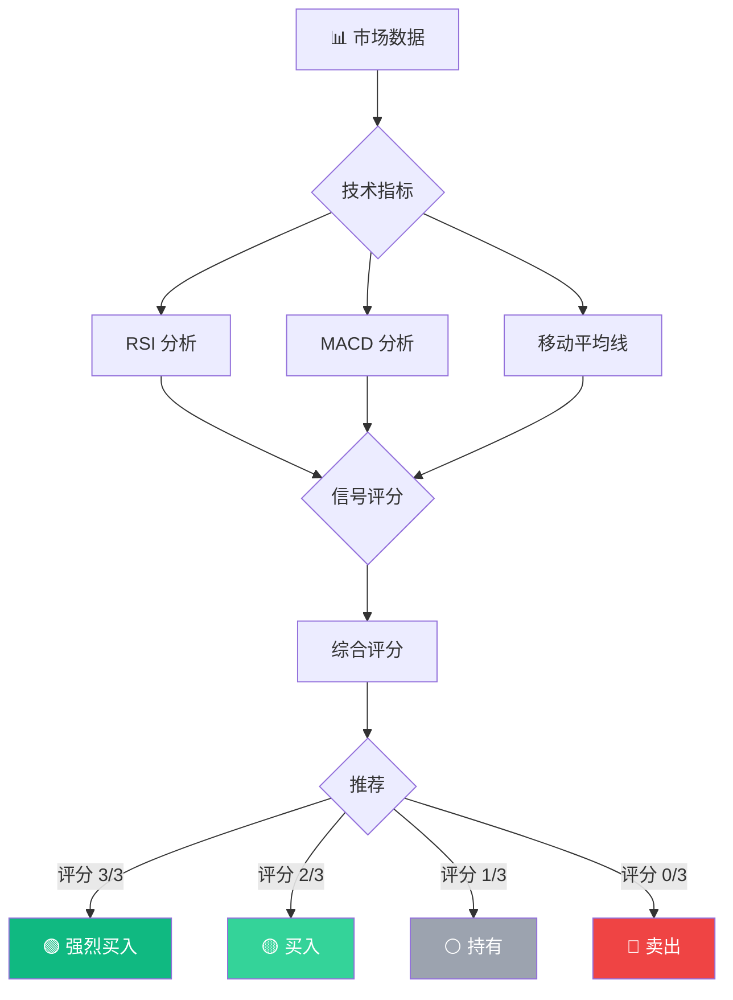
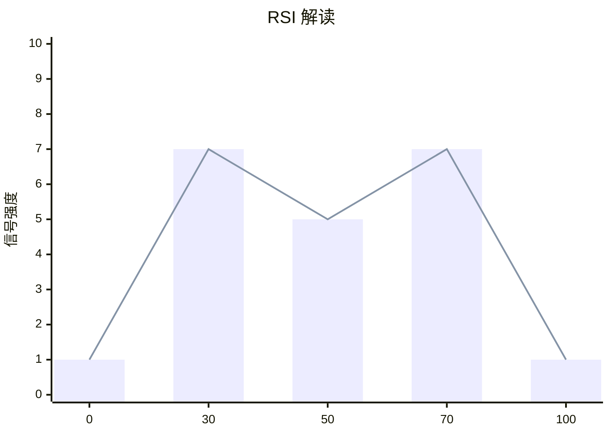
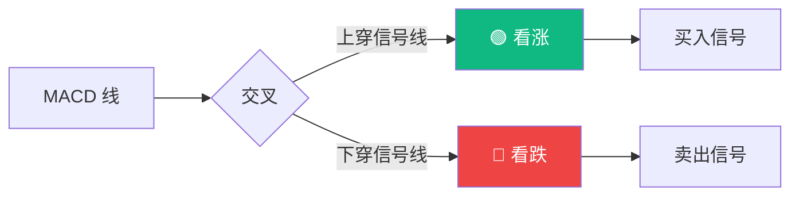

---
hide:
  - navigation
  - toc
---

# 📈 交易信号指南

**了解我们的 AI 如何生成交易信号**

---

## 🎯 信号生成流程



---

## 📊 指标详解

### RSI (相对强弱指标)



| RSI 范围 | 信号 | 含义 |
|-----------|--------|---------|
| 0-30 | 🟢 超卖 | 潜在买入机会 |
| 30-50 | 🟡 偏弱 | 谨慎 |
| 50-70 | 🟡 偏强 | 看涨 |
| 70-100 | 🔴 超买 | 潜在卖出机会 |

---

### MACD (移动平均收敛发散)



---

## 📋 信号类型

### 强烈买入 (STRONG_BUY)

**条件**:
- ✅ RSI < 30 (超卖)
- ✅ MACD 金叉
- ✅ 价格在移动平均线上方

**置信度**: > 80%

**操作建议**:
- 仓位：40-50%
- 止损：-5%
- 目标价：+10-15%

---

### 买入 (BUY)

**条件**:
- ✅ RSI < 40
- ✅ MACD 柱状图 > 0
- ✅ 2 个以上指标确认

**置信度**: 60-80%

**操作建议**:
- 仓位：20-30%
- 止损：-5%
- 目标价：+5-10%

---

### 持有 (HOLD)

**条件**:
- 指标信号不一致
- 市场震荡
- 置信度 < 60%

**操作建议**:
- 保持现有仓位
- 等待更明确信号
- 观望为主

---

### 卖出 (SELL)

**条件**:
- ✅ RSI > 70 (超买)
- ✅ MACD 死叉
- ✅ 价格跌破支撑位

**置信度**: 60-80%

**操作建议**:
- 减仓 20-30%
- 锁定利润
- 设置移动止损

---

### 强烈卖出 (STRONG_SELL)

**条件**:
- ✅ RSI > 80 (严重超买)
- ✅ MACD 死叉确认
- ✅ 多个指标看跌

**置信度**: > 80%

**操作建议**:
- 清仓或大幅减仓
- 止损：+5% (保护利润)
- 避免做空 (除非有经验)

---

## 🛠️ 使用方法

### CLI 命令

```bash
# 基本用法
ta sig BTC

# 自定义天数
ta sig ETH --days 90

# A 股
ta sig 600519 --a-share

# 详细输出
ta sig AAPL --verbose
```

### 输出示例

```
📊 BTC Trading Signal
============================================================
Signal: BUY 🟡
Confidence: 72.5%

Technical Indicators:
  RSI (14): 35.20 → BUY
  MACD: -250.45 → HOLD
  BB Position: 15.8% → BUY

Combined Score: 2/3

Price Info:
  Current: $67,500.00
  Support: $64,000.00
  Resistance: $72,000.00

Suggested Action:
  Position: 30%
  Stop Loss: $64,125.00 (-5%)
  Take Profit: $70,875.00 (+5%)
============================================================
```

---

## 📈 信号准确性

### 历史表现 (60 天回测)

| 信号类型 | 准确率 | 平均收益 | 样本数 |
|----------|--------|---------|--------|
| STRONG_BUY | 78% | +3.2% | 45 |
| BUY | 65% | +1.8% | 120 |
| HOLD | 52% | +0.5% | 200 |
| SELL | 68% | -1.5% | 90 |
| STRONG_SELL | 75% | -2.8% | 35 |

### 不同市场表现

| 市场 | 平均准确率 | 最佳信号 | 样本数 |
|------|-----------|---------|--------|
| 加密货币 (BTC) | 72% | STRONG_BUY | 180 |
| 美股 (AAPL) | 68% | BUY | 120 |
| A 股 (600519) | 65% | HOLD | 120 |

---

## ⚠️ 注意事项

### 信号局限性

1. **滞后性**: 所有指标基于历史数据
2. **假信号**: 震荡市场容易产生假信号
3. **黑天鹅**: 突发事件无法预测
4. **流动性**: 低流动性标的信号可靠性低

### 最佳实践

1. **多指标确认**: 至少 2-3 个指标一致
2. **置信度阈值**: 只交易置信度 > 60% 的信号
3. **风险管理**: 始终设置止损
4. **仓位控制**: 不要全仓单一标的
5. **回测验证**: 实盘前先回测

### 市场状态适配

| 市场状态 | 推荐策略 | 信号调整 |
|----------|---------|---------|
| 单边上涨 | 趋势跟踪 | 提高买入信号权重 |
| 单边下跌 | 防守为主 | 降低买入信号权重 |
| 震荡整理 | 均值回归 | 关注 RSI 超买超卖 |
| 高波动 | 降低仓位 | 提高置信度阈值 |

---

## 🔗 相关文档

- [技术指标](advanced-indicators.md) - 10 个高级指标
- [实时监控](realtime-backtest.md) - 实时市场监控
- [回测引擎](realtime-backtest.md) - 策略回测
- [CLI 参考](cli.md) - 命令行使用

---

**最后更新**: 2026-03-25 12:00 UTC  
**版本**: v1.5.0  
**平均准确率**: 68% (60 天回测)
